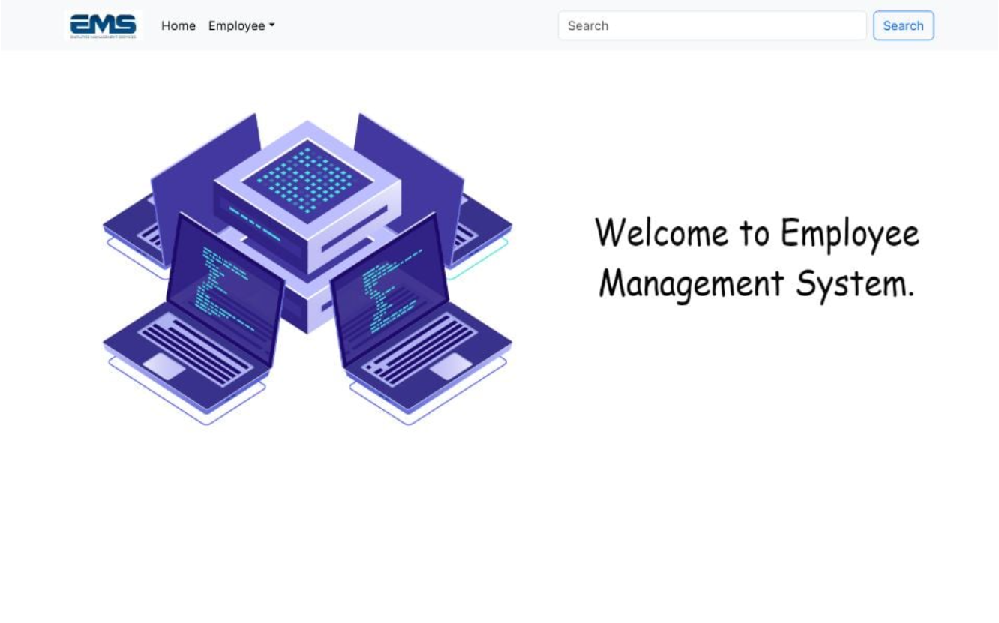

# 🚀 PR7-Navigator

PR7-Navigator is a modern React web application built using Vite for fast development and optimized production builds.
The project serves as a foundation for building navigation-based interfaces and scalable frontend applications.

## 🔗 Live Demo: https://pr-7-navigator.vercel.app/

## 📌 About The Project

- PR7-Navigator is developed to practice and implement:

- Component-based architecture

- Fast development setup using Vite

- Clean UI structure

- Production deployment using Vercel

- This project demonstrates how to set up and deploy a modern React application efficiently.

## 🛠️ Tech Stack

- React	JavaScript library for building UI
- Vite	Fast build tool & development server
- JavaScript (ES6+)	Core programming language
- CSS	Styling
- Vercel	Deployment & hosting

## 📷 Preview
